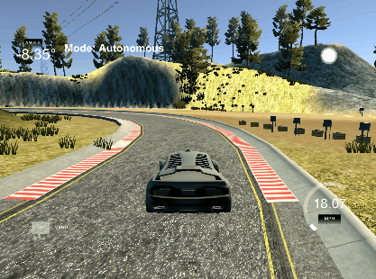
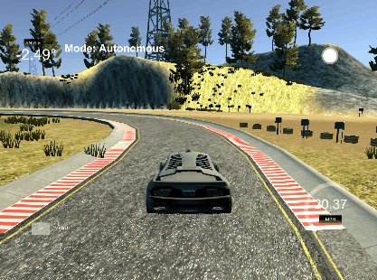
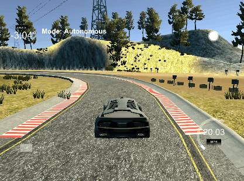

[](https://travis-ci.org/avrabe/CarND-PID-Control-Project)
[](https://www.codacy.com/app/avrabe/CarND-PID-Control-Project?utm_source=github.com&amp;utm_medium=referral&amp;utm_content=avrabe/CarND-PID-Control-Project&amp;utm_campaign=Badge_Grade)

# CarND-Controls-PID
Self-Driving Car Engineer Nanodegree Program

</br>

### The effect of P, I, D

The **p**roportional component did directly effect the steering based on the cross track
error (cte) received. As seen in the table below, just using p results especially
in curves into overshooting and hard steering of the car to get back on track.
In the example below we see that the car is at the ledges of the street.
This was described also in the classroom and the algorithm behaves as expected.

The effect of oversteering can be softened by using additionally the **i**ntegral component.
The previous cte is then also taken into account and the steering towards a minimal
cte will be softened. In the table below we can see that the car will not
touch the ledges anymore.

Using p and i I can see that, when necessary the car steers hard (if the cte gets'
too big) but soon after the steering will be damped and the oversteering will
be dramatically reduced.

The **d**erivative component did not seem to have much effect (and sometimes even
worsened the results). This component usually is used to balance out drift.
I assume that the simulator is in some kind of "ideal" world no or not much drift,
the effect of using it can't be seen and would be expected.

|  image           |   |  |  |
|------------------|----------------------------|----------------------------|---------------------------|
|  p               |  10                        |  10                        | 10                        |
|  i               |  0                         | 500                        | 500                       |
|  d               |  0                         | 0                          | 50                        |


### Chosen Hyperparamater

I've chosen the hyperparamaters with a defined
throttle of 0.2 - 0.19 * abs( calculated new steering value ).

I started to implement the twiddle algorithm from the lecture.
I just replaced the make_robot() with the restart of the simulator into
the PID simulation. Additional run() was replaced with the start of
the pid controller with the defined pid values and with a running time
of 120s. The result after 42 iterations was.

| automatic |  p    |  i    | d     | total error |
|-----------|-------|-------|-------|-------------|
| twiddled  | 8.51  | 11.36 | 2.09  | 0.356992    |

In addition, to prepare for the first question about the effect of
p, i and d, I choose some manual values (and used the twiddled result as
base).

| manual (p)|  p    |  i    | d     | total error |
|-----------|-------|-------|-------|-------------|
|    1      | 10    | 0     | 0     | 0.44598     |


| manual (pi)|  p    |  i    | d     | total error |
|------------|-------|-------|-------|-------------|
|    2       | 10    | 200   | 0     | 0.127832    |
|    3       | 10    | 500   | 0     | 0.0902475   |
|    4       | 10    | 800   | 0     | 0.0827055   |
|  **5**     | **12**|**800**|**0**  |**0.0657949**|


| manual (pid)|  p    |  i    | d     | total error |
|-------------|-------|-------|-------|-------------|
|    6        | 10    | 200   | 50    | 0.123404    |
|    7        | 10    | 500   | 50    | 0.0905311   |
|    8        | 10    | 800   | 500   | 0.0803096   |

I've noticed that it was possible to further reduce the
total error using the manual parameters. As of this I finally
chose p = 12, i = 800 and d = 0.

In the final implementation I updated the throttle by
throttle of 0.4 - 0.39 * abs( calculated new steering value )
to enable the car to drive the lap faster. This increases the
total error from 0.0657949 to 0.19. Since the car does not
drive onto the ledges and can drive up to 48km/h I still
choose to drive faster.

---

## Dependencies

* cmake >= 3.5
 * All OSes: [click here for installation instructions](https://cmake.org/install/)
* make >= 4.1
  * Linux: make is installed by default on most Linux distros
  * Mac: [install Xcode command line tools to get make](https://developer.apple.com/xcode/features/)
  * Windows: [Click here for installation instructions](http://gnuwin32.sourceforge.net/packages/make.htm)
* gcc/g++ >= 5.4
  * Linux: gcc / g++ is installed by default on most Linux distros
  * Mac: same deal as make - [install Xcode command line tools]((https://developer.apple.com/xcode/features/)
  * Windows: recommend using [MinGW](http://www.mingw.org/)
* [uWebSockets](https://github.com/uWebSockets/uWebSockets)
  * Run either `./install-mac.sh` or `./install-ubuntu.sh`.
  * If you install from source, checkout to commit `e94b6e1`, i.e.
    ```
    git clone https://github.com/uWebSockets/uWebSockets 
    cd uWebSockets
    git checkout e94b6e1
    ```
    Some function signatures have changed in v0.14.x. See [this PR](https://github.com/udacity/CarND-MPC-Project/pull/3) for more details.
* Simulator. You can download these from the [project intro page](https://github.com/udacity/self-driving-car-sim/releases) in the classroom.

There's an experimental patch for windows in this [PR](https://github.com/udacity/CarND-PID-Control-Project/pull/3)

## Basic Build Instructions

1. Clone this repo.
2. Make a build directory: `mkdir build && cd build`
3. Compile: `cmake .. && make`
4. Run it: `./pid`. 

## Editor Settings

We've purposefully kept editor configuration files out of this repo in order to
keep it as simple and environment agnostic as possible. However, we recommend
using the following settings:

* indent using spaces
* set tab width to 2 spaces (keeps the matrices in source code aligned)

## Code Style

Please (do your best to) stick to [Google's C++ style guide](https://google.github.io/styleguide/cppguide.html).

## Project Instructions and Rubric

Note: regardless of the changes you make, your project must be buildable using
cmake and make!

More information is only accessible by people who are already enrolled in Term 2
of CarND. If you are enrolled, see [the project page](https://classroom.udacity.com/nanodegrees/nd013/parts/40f38239-66b6-46ec-ae68-03afd8a601c8/modules/f1820894-8322-4bb3-81aa-b26b3c6dcbaf/lessons/e8235395-22dd-4b87-88e0-d108c5e5bbf4/concepts/6a4d8d42-6a04-4aa6-b284-1697c0fd6562)
for instructions and the project rubric.

## Hints!

* You don't have to follow this directory structure, but if you do, your work
  will span all of the .cpp files here. Keep an eye out for TODOs.

## Call for IDE Profiles Pull Requests

Help your fellow students!

We decided to create Makefiles with cmake to keep this project as platform
agnostic as possible. Similarly, we omitted IDE profiles in order to we ensure
that students don't feel pressured to use one IDE or another.

However! I'd love to help people get up and running with their IDEs of choice.
If you've created a profile for an IDE that you think other students would
appreciate, we'd love to have you add the requisite profile files and
instructions to ide_profiles/. For example if you wanted to add a VS Code
profile, you'd add:

* /ide_profiles/vscode/.vscode
* /ide_profiles/vscode/README.md

The README should explain what the profile does, how to take advantage of it,
and how to install it.

Frankly, I've never been involved in a project with multiple IDE profiles
before. I believe the best way to handle this would be to keep them out of the
repo root to avoid clutter. My expectation is that most profiles will include
instructions to copy files to a new location to get picked up by the IDE, but
that's just a guess.

One last note here: regardless of the IDE used, every submitted project must
still be compilable with cmake and make./
